## Ownership and activation[^1]

```mermaid
%%{init: { "theme": "forest", "themeVariables": { "fontFamily": "monospace" } }}%%

sequenceDiagram
    participant ButtonElement as ButtonElement 🆗     
    participant Owner       as Owner 🚩
    participant Signal      as Signal 🔌
    participant Subscription as Observer 👁️
    participant DomApi      as DomApi 🕸️

    %% Mount + subscribe
    ButtonElement->>Owner: activate()
    Owner->>Signal: subscribe(callback)
    Signal-->>Subscription: create(callback)
    activate Subscription  
    Signal-->>Subscription: onNext(newLabel)
    Subscription->>DomApi: setHtmlProperty(button, text, newLabel)
    Note right of DomApi: Sets the <br/>new translation
    deactivate Subscription
```

[^1]: Simplified view, for more check out [laminar docs](https://laminar.dev/documentation#laminars-use-of-airstream-ownership)

^  - let's look a bit further under laminar's hood to see how this works, what i show here is all internal, don't worry, but it helps to form a mental model
 - if we look at how things work for our button
 -	activate(): when the element is mounted in the DOM, it gets an Owner, which tracks its subscriptions. Activate is called on this Owner
  - let's say we have signal, like this internationalization signal
	-	subscribe(callback): subscribing to the signal with a callback gives us an Observer
	-	signal calls onNext on our observer instance every time the signal updates
	-	this callback is actually setHtmlProperty(…, text, newText): updates the button’s text

---

## Ownership and deactivation[^1]

```mermaid
%%{init: { "theme": "forest", "themeVariables": { "fontFamily": "monospace" } }}%%

sequenceDiagram
    participant ButtonElement as ButtonElement 🆗     
    participant Owner       as Owner 🚩
    participant Signal      as Signal 🔌
    participant Subscription as Observer 👁️

    %% Unmount + cleanup
    activate Subscription
    ButtonElement->>Owner: deactivate()
    Owner-->>Subscription: kill()
    Subscription-->>Signal: unsubscribe
    deactivate Subscription
```

[^1]: Simplified view, for more check out [laminar docs](https://laminar.dev/documentation#laminars-use-of-airstream-ownership)

^ - when the button is unmounted from the DOM 
 - deactivate() is called on the owner
 - owner in turn calls kill() on the observer
 - observer can then unsubscribe, for a leak-free operation
 - let's now show a bit the kind of expressive power we gain with these mechanisms
