slide-transition: true
build-lists: true
theme: Terasol
footer: Full-stack Scala
slidenumbers: true
autoscale: true

[.hide-footer]


^ Wait, full-stack Scala? do you mean full-stack, as in including the front-end?

---
## What? _**front-end**_ in Scala? 😮 

---
## What? _**front-end**_ in Scala? 

### Yep, _**front-end**_ and even _**ops**_ in Scala 🚀

^ as it turns out, you can do everything in Scala, all the way to deployment

---
## Cool, but what's the _**advantage**_? 🤔

^ - typical reaction is kind of ok that's cool, but who does that
- it's a tough one, people are afraid of non-mainstream (hiring etc.)
- main reason i'm here talking, to show that it's really possible and advantageous to do everything in Scala 

---
## Who _**wouldn't**_ want... 🤩

 - 🧑‍🤝‍🧑 _Type-based_ team alignment
- 🦺 Higher bus factor 
 - 🔹 Smaller & leaner codebase
 - 👣 Reduced overall dependency surface
 - 💄 Cutting-edge UX
 - 🚀 WASM performance with flawless interop
 
^  - the entire team is able to intervene on all the parts, front-end, back-end, infra. They exchange in an ubiquitous language based on the same rich types.
 - thanks to this, loss of a team member is less detrimental, others can step in more easily, compare that vs having a teraform specialist, a typescript specialist, etc. and all of a sudden they are gone
 - the codebase as a whole is leaner. benefit from code sharing between front and back, and from Scala's expressiveness. No more huge quantities of teraform YAML, helm charts, API definitions, etc.
 - third-party library surface and ecosystem is also naturally reduced. Less update work, less possibilities for unwanted regression, etc.
 - laminar is super powerful and allows for richly interactive experiences
 - some say webassembly is the future for many applications, imagine doing AI in the browser for privacy etc.

---
## But...I'm a __backend__ engineer, period!
 - 💪 Think about it, you can do it all by ourself!
 - 🤖 AI age calls for generalists 
 - 🌟 Don't worry, your Scala skills will shine everywhere
 - 🥲 Programming joy FTW

^ - Ask the audience a show of hands if they consider themselves backend engineers
- I felt it very empowering personnaly, i can now build complete systems on my own, with solid tools
- Models are very good for specialized tasks, so now it's more and more about assembling pieces together and driving models
- Scala is powerful and mastering it means you will become immediatly very productive in these other domains
- Let's not forget this essential component, enjoying what we do is important and transpires on the systems we create   

---
## Past 10 months: my **full-stack** journey with Scala

- After 7 years of backend & microservices about 🚐 and 🚗
- Let's plant some 🌳! 

^  - I've spent 7 years building microservices for the Bestmile fleet orchestration platform here in Lausanne
 - I'm very sensitive to the impact of what we do, the responsibility we have in choosing what we work for 
 - I was approached to build a geospatial decision support system for urban renaturation, so I decided ok let's give it a go  

---


^ - Still a prototype, the system shows various specialized maps, allows selecting parcels, taking measurements etc.
- My purpose here is to walk you through this codebase and share a bit of what I learned

---
## `build.sbt` structure
[.column] 


^ - Ok, finally getting more technical, i know you were getting bored
- I'm using good old sbt, here's the structure. 
- As you can see, a project is shared between front and back

---
## `shared` project namespaces
- 📁 `endpoints`: endpoint definitions (using `tapir`)
- 📁 `model`: data classes 
- 📁 `i18n`: translation data classes  

^ - In this shared project, we mainly find
- use tapir algebra to define our API, this is great to align client and server
- model contains all the data classes of the API, together with serialization aspects
- i18n i mention this here specifically because i'll use this common use case as an example throughout this presentation 

---
## `tapir` endpoint definitions
[.code-highlight: 1-2]
[.code-highlight: 3-4]
[.code-highlight: 5]
[.code-highlight: 6-7]
[.code-highlight: 8-9]
[.code-highlight: 10-11]
[.code-highlight: 12-14]
[.code-highlight: 1-14]

^ - Finally some code! I promise you'll see much more aha
- tapir imports, including generic schema derivation, i.e. the "shape" of the data, which will be used for generating the client and server code and documentation
- we use micropickle, a lightweight serialization library 
- definitions in a trait allow for mixins while keeping aspects separate
- This is the endpoint that allows for retrieving translations. We express it with tapir DSL, with a path parameter of type Language, we'll see in a second how this is defined. I take this example because it's simple, and kind of universal to apps.
- we specify the types of response and error, micropickle codec is picked up by tapir
- then it's documentation specification

```scala
import sttp.tapir.*
import sttp.tapir.json.upickle.*
import com.terasol.exomap.shared.i18n.I18n
import com.terasol.exomap.shared.model.Language
import sttp.tapir.codec.iron.given

trait I18nEndpoints extends CacheHeaders:
  val i18n = endpoint.get
    .in("i18n" / path[Language]("lang"))
    .out(jsonBody[Translations])
    .out(oneHourCache)
    .description("Get translations for a certain language")
    .name("i18n")

```
---
## Iron types
```scala
import io.github.iltotore.iron.*
import io.github.iltotore.iron.constraint.string.*

type Language = Language.T
object Language extends RefinedType[String, Match["^(en|fr|de|es|it)$"]]
```
- 💅 Runtime & compile-time type "refinements"
- ✅ Capture domain value constraints
- ⏬ Thanks to modules ecosystem, all the way into the DB 🛢️ !  

^ - Here's how this `Language` type is defined, we use the iron library to define refined newtypes. We support only certain languages.
- the http request will fail if this constraint isn't satisfied
- there is support for doobie as well, well see later 

---
## Codec derivation
```scala
import upickle.default.*

case class Translations(popup: PopupLabels, map: MapLabels, settings: SettingsLabels) derives ReadWriter
case class PopupLabels(computing: String, parcel: String) derives ReadWriter
// ...
```

 - ⚙️ autogeneration of `ReadWriter` JSON codec
 - 1️⃣ plain case classes, single definition
 - 🔗 relaxed versioning when client/server are coupled    

^ - here are the data classes involved in this endpoint
 - use the typeclass derivation syntax of Scala 3 for codecs
 - one interesting aspect of working with shared definitions is that you can be more relaxed about versioning. Because it's a coupled system, same team, same codebase, you deploy updates at the same time. You can trigger client reload upon deploy for high availability app.
 - for a service API, different use case, you can name these data classes with version numbers  

---

## `client` project
[.code-highlight: 1-3]
[.code-highlight: 4]
[.code-highlight: 5]
[.code-highlight: 6-7]
[.code-highlight: 8-11]
[.code-highlight: 12-21]
```scala
lazy val client = project
  .in(file("client"))
  .dependsOn(shared.js)
  .enablePlugins(ScalaJSPlugin)
  .enablePlugins(ScalablyTypedConverterExternalNpmPlugin)
  .settings(
    scalaJSUseMainModuleInitializer := true,
    scalaJSLinkerConfig ~= {
      _.withModuleKind(ModuleKind.ESModule)
        .withModuleSplitStyle(ModuleSplitStyle.SmallModulesFor(List("exomap")))
    },
    externalNpm := baseDirectory.value,
    libraryDependencies ++= Client.dependencies.value,
  )
 
```
^ - This is what I wanted to share about the common, shared project between front and back
- Let's now look at the client project 
- Tell Scala.js that this is an application with a main method
- Emit ECMAScript modules
- Configure Scala.js to emit modules in the optimal way to connect to Vite's incremental reload
- Scalajs sbt plugin can use npm as package manager, more about that shortly 

---

## `client` project namespaces
- 📁 `behaviors`: reactive, laminar-powered logic
- 📁 `components`: generic UI components 
- 📁 `pages`: browsable pages
- 📁 `services`: abstractions over endpoints and other sources
- 📁 `state`: models capturing UI state

^ - But first, let's see how the client is structured. Note that this is a structure that I invented that works for me, it's by no means required or standard or anything like that
- in behaviors, i put all the code that describes things that happen in reaction to user events, scheduled events, async responses etc.  
- components is self-explanatory, self-contained UI code for things like popup, map, modal dialog, etc.
- pages, in there i have pages for each virtual route, this makes use of laminar routing ability. this is where the overal UI is assembled
- services, abstractions to endpoints or third-party APIs. Abstractions make it possible to test dependent pieces of logic
- state, this is where client-specific models and application state is captured 

---
## Just a **standard** Vite project 

📄 `vite.config.js`

```js
import scalaJSPlugin from "@scala-js/vite-plugin-scalajs";
```

^ - As mentionned before, it's just a vite project, and scalajs has a vite plugin that makes vite aware of scalajs build and allows for hot reload

---
## Just a **standard** Vite project: `package.json`

```js
{
  "name": "exomap",
  "private": true,
  "type": "module",
  "scripts": {
    "dev": "vite",
    "build": "vite build",
    "preview": "vite preview",
    "clean": "rm -rf dist"
  },
  "devDependencies": {
    "@scala-js/vite-plugin-scalajs": "^1.0.0",
    "autoprefixer": "^10.4.20",
    "tailwindcss": "^4.1.5",
    "typescript": "^5.8.2",
    "vite": "^6.2.0"
  },
  "dependencies": {
    "@tailwindcss/vite": "^4.1.5",
    "flowbite": "^3.1.2",
    "maplibre-gl": "^5.2.0"
  }
}
```

^ as you can see, we even end up with a package.json in our scala project, which is kind of funny 

---
## Web app entry point
```scala
  @main
  def Exomap(): Unit =
    renderOnDomContentLoaded(
      dom.document.getElementById("app"),
      appElement()
    )

  def appElement() = div(...)
  ```  
 - Just a standard Scala app with a `main`
 - Inject Laminar-managed root node in `<app>` element in `index.html`'s `<body>`

^ - What is actually a scalajs app, well, it's just a standard scala app with a main method
 - make use of laminar's renderOnDomContentLoaded() which hooks laminar to an app element

---
## Let's create a button with Laminar! 


^ - Laminar is a really awesome UI library for scalajs
 - Somewhat hidden gem honestly. Maybe the closest in JS world is solidjs. Also has similarities to Elm.
 - Let's see how to define buttons using Laminar

---
## Laminar elements

```scala
import com.raquo.laminar.api.L.*

def applyChangesButton = button("Apply changes")
```

^ - With laminar, you first import the api
- this gives you access to a kind of DSL to create DOM elements

---
## Tailwind CSS  styling
[.code-highlight: 4-10]

```scala
import com.raquo.laminar.api.L.*

def applyChangesButton = button("Apply changes", 
  cls := """bg-white hover:bg-gray-200 
  border-1 border-gray-300 
  disabled:text-gray-400 
  px-4 py-2 
  rounded""")
```

^ - Tailwind is growing trend in the web 
 - basically use pre-defined classes to define the look of elements
 - it's called utility-first design: composable classes, directly in HTML instead of custom CSS
 - vite tailwind plugin watches the files and generates the CSS corresponding to the classes

---


---
## Tailwind CSS  IntelliSense


^  Plugin, can be customized to pick on scala files

---
## Flowbite components 


^ - Ideally suited for buiding apps with laminar because it's straight DOM! 
 - You can also use webcomponents such as https://webawesome.com/ 
 - Replaces react components

---
## Internationalization 🌐
[.code-highlight: 1-5]
[.code-highlight: 6]
[.code-highlight: 1-7]

```scala
import com.raquo.laminar.api.L.*

def applyChangesButton(using locale: LocaleState) = 
  button(
    text <-- locale.i18n$(_.settings.panel.applyChangesButton), 
    cls := "bg-white hover:bg-gray-200 border-1 border-gray-300 disabled:text-gray-400 px-4 py-2 rounded")
```

^ - Use this universal topic of internationalization to introduce one of laminar's main abstractions: signal
 - This apply changes button needs to adapt dynamically to language setting 
 - <-- is laminar subscription operator
 - we are here subscribing the text property of the button to language changes of this particular label
 - this internationalization$ expression is a signal, coming out of locale state
 - let's see how LocaleState is defined

---
## Vars and signals 🔌
[.code-highlight: 1-4]
[.code-highlight: 4-6]
[.code-highlight: 7-9]

```scala
import com.raquo.airstream.state.Var
import com.raquo.airstream.core.Signal
import com.terasol.exomap.shared.i18n.Translations

trait LocaleState:
  val currentTranslations: Var[Translations]
  
  def i18n$(selector: Translations => String): Signal[String] = currentI18n.signal.map(selector(_))
```

^ - A Var, here containing all labels for a certain language, represents mutable state that can be observed
 - from this var, we can derive a signal that allow us to subscribe to changes

---

# Laminar's parallel 🌳


^ - You might ask how does Laminar manage these subscriptions
 - The way it works is that Laminar builds a hierarchy of elements parallel to the dom. 
 - Laminar-managed elements have a common `RootNode` 
 - Important to note here, it's not at all a virtual DOM, just a way to track mounting/unmounting of elements in the DOM 
 - this in turn allows subscription ownership management: activating subscriptions and deactivating to avoid leaks

---

## Ownership and activation[^1]

```mermaid
%%{init: { "theme": "forest", "themeVariables": { "fontFamily": "monospace" } }}%%

sequenceDiagram
    participant ButtonElement as ButtonElement 🆗     
    participant Owner       as Owner 🚩
    participant Signal      as Signal 🔌
    participant Subscription as Observer 👁️
    participant DomApi      as DomApi 🕸️

    %% Mount + subscribe
    ButtonElement->>Owner: activate()
    Owner->>Signal: subscribe(callback)
    Signal-->>Subscription: onNext(newLabel)
    Subscription->>DomApi: setHtmlProperty(button, text, newLabel)

```



[^1]: Simplified view, for more check out [laminar docs](https://laminar.dev/documentation#laminars-use-of-airstream-ownership)

^ -	activate(): proves the element is mounted
	-	subscribe(callback): creates a non-dynamic Subscription (Observer)
	-	emits newText:String: every time the signal updates
	-	setHtmlProperty(…, text, newText): updates the button’s text

---

## Ownership and deactivation[^1]

```mermaid
%%{init: { "theme": "forest", "themeVariables": { "fontFamily": "monospace" } }}%%

sequenceDiagram
    participant ButtonElement as ButtonElement 🆗     
    participant Owner       as Owner 🚩
    participant Signal      as Signal 🔌
    participant Subscription as Observer 👁️

    %% Unmount + cleanup
    ButtonElement->>Owner: deactivate()
    Owner-->>Subscription: kill()
    Subscription-->>Signal: unsubscribe
```


[^1]: Simplified view, for more check out [laminar docs](https://laminar.dev/documentation#laminars-use-of-airstream-ownership)

^ -	deactivate() → kill() → unsubscribe: tears down the observer on unmount
 - let's now show a bit the kind of expressive power we gain with signals

---

## *Behaviors*: **functional reactive** logic 🛝


```scala
def i18nBehavior()(using locale: LocaleState, i18nService: I18nService): Modifier.Base =
  locale.currentLanguage.signal.flatMapSwitch(i18nService.retrieveTranslations) --> locale.currentTranslations
```

^ - Laminar allows for functional reactive coding style 
 - Example here: we react to language change by loading I18n labels
 - to do this, we use a high-order FRP operator, flatMapSwitch

---

## Essential FRP operator: **flatMapSwitch** 🛝

```mermaid
%%{init: { "theme": "forest", "themeVariables": { "fontFamily": "monospace" } }}%%

sequenceDiagram
    autonumber
    participant Switcher as languageSwitcher 🔘
    participant Lang    as currentLanguage 📚
    participant FlatMapSwitch as flatMapSwitch 🔀
    participant i18nService as i18nService ☁️
    participant Locale  as locale

    Switcher->>Lang: set "fr"
    Lang->>FlatMapSwitch: "fr" event
    FlatMapSwitch->>i18nService: switch to: retrieveTranslations("fr")
    i18nService->>Locale: set Translations(fr)

    Switcher->>Lang: set "en"
    Lang->>FlatMapSwitch: "en" event
    FlatMapSwitch->>i18nService: switch to: retrieveTranslations("en")
    i18nService->>Locale: set Translations(en)

```  



`currentLanguage$` __*flatMapSwitch*__ `i18nService.retrieveTranslations` `-->` `locale.currentTranslations`

^ - switch in flatMapSwitch means that the stream mirrors the inner stream
  - when there is an "fr" event, launch an inner stream which retrieves the french translations via the internationalization service - because this is an async call the API, it's represented as a stream
  - when we get the translations, we set the locale
  - later on, if we switch to english, there is another event on the parent stream, we switch to the new inner stream  
  - note that events propagate through the observer graph: so when we set the current translations in locale, this is a Var, and it might trigger other events downstream

---
## Behavior ⚙️ unit coverage ✅

```scala
 property("translations match the current language"):
    forAll: (additionalTranslations: Map[Language, Translations]) =>
      val translationsMap = additionalTranslations + (Language("en") -> Translations.default)
      given locale: LocaleState = mockedLocale
      given I18nService = new I18nService:
        def retrieveTranslations(language: Language) = EventStream.fromValue(translationsMap(language))

      withActivatedSubscriptions(i18nBehavior()):
        translationsMap.keys.foreach(locale.currentLanguage.set)
        assertEquals(
          locale.currentTranslations.now(),
          translationsMap(locale.currentLanguage.now())
        )
```        

^ - behavioral logic is what i generally like to have unit coverage for
 - in this case the logic is trivial but i'm just showing here how you can use your traditional testing tools from the scala ecosystem
 - munit property test with scalacheck
 - not getting into the details but this property verifies that for all translations the current one matches the language

---
## Application state management 🗄️


^ - If you have ever coded UIs you will probably agree that managing state is a big deal
 - This diagram shows how I organized state and how with signals we create a graph of behaviors reacting to events and state changes
 - 1. `State` contains all application state
 - 2. what i called behavioral logic listens to signals
 - 3. it might set elements of state, which in reaction trigger other events, etc.
 - 4. Then you have what I call UI components: these components are relatively generic and also have elements of state that are local to this component
  - 5. behaviors describe how global state is wired to local state when mounted
  - 6. and vice/versa, describes how events influence evolution of global state
 - In summary, what i call behaviors act a bit as a switchboard   
 - Application state you potentially save in local storage or on the server
 - Mention it's the way I found to organize things, but you could do differently

---
## **Redux** in Laminar 
[.code-highlight: 1-8]
[.code-highlight: 9-10]
[.code-highlight: 11-16]
[.code-highlight: 17-21]

```scala
import com.raquo.laminar.api.L.*

class ReduxBehavior[Action, State, Effect](
    actionsBus: EventBus[Action],
    maybeState: Var[Option[State]],
    reducer: (Action, Option[State]) => (Option[State], List[Effect]),
    effector: EventStream[Effect] => EventStream[Action]
):
  def modifier: Modifier.Base =
    val reducedActionsStream = actionsBus.toObservable.withCurrentValueOf(maybeState).map(reducer.tupled)
    val reducedStateStream = reducedActionsStream.map:
      case (newState, _) => newState
    val reducedEffectsStream = reducedActionsStream
      .map:
        case (_, effects) => effects
      .flatMapMerge(EventStream.fromSeq(_))
    modSeq(
      reducedStateStream --> maybeState,
      effector(reducedEffectsStream) --> actionsBus.writer
    )
```

^ - As a matter of fact, with Laminar you have full flexibility on how to organize your code
 - Can replicate redux pattern for more complex state
 - Not delving into the details here but it's just to illustrate how flexible this is
 - Useful when interactions become complex, to define behavior with a strict state machine
 - I'm actually using this for an editor which has a lot of state and possible interactions

---
## Integration with **JS** libraries 

- A number of wrappers exist for mainstream libs or you can roll your own
- `ScalablyTyped` can convert TypeScript bindings to scala.js 🪄

^ - Another big topic is how to piggback on the massive JS library ecosystem
 - what i am using and is absolutely fantastic is scalablytyped
 - sbt plugin that can generate scala wrappers from typescript definitions

---
## Integration with **maplibre** 

```scala
class MapLibreAdapter(using Locale, ...):
  val embedder: Modifier[ReactiveHtmlElement[HTMLElement]] =
    onMountUnmountCallbackWithState(
      mount = context => maplibre.Map(MapOptions(context.thisNode.ref)),
      unmount = (_, maybeMap) => maybeMap.foreach(_.remove())
    )
```

^ - In fact, as you've seen from the videos, it's a map-centric app, i'm using maplibre
 - maplibre is a big JS component that supports WebGL rendering
 - it works by hooking itself to a DOM element
 - we can hook it into a laminar element using this method that allows defining `mount` and `unmount` callbacks

---
## Integration with **maplibre**

```scala
class MapLibreAdapter(using Locale, ...):
  val embedder: Modifier[ReactiveHtmlElement[HTMLElement]] =
    onMountUnmountCallbackWithState(
      mount = context => maplibre.Map(MapOptions(context.thisNode.ref)),
      unmount = (_, maybeMap) => maybeMap.foreach(_.remove())
    )
```

🪝 hook it in the DOM:

```scala
div(
  cls := "h-screen w-screen antialiased absolute inset-0",
  mapLibre.embedder
)
```    

<!-- ---
## Efficient lists

With laminar we create a single element per identifier
Using split, we describe this setup
And we perform updates on this existing element, we don't recreate it every time
Those precise update semantics avoid need for VDOM thanks to FRP -->

---
## **Service** abstraction  
[.code-highlight: 1-5]
[.code-highlight: 6-8]

```scala
package com.terasol.exomap.client.services

import com.raquo.airstream.core.EventStream
import com.terasol.exomap.shared.i18n.I18n
import com.terasol.exomap.shared.model.Language

trait I18nService:
  def retrieveTranslations(language: Language): EventStream[Translations]
```

---
## *Sstp* **fetch-based** implementation  
[.code-highlight: 1]
[.code-highlight: 2-3]
[.code-highlight: 4-11]
[.code-highlight: 1-11]

```scala
class ApiClientBasedI18Service extends I18nService with I18nEndpoints:
  def retrieveTranslations(language: Language): EventStream[Translations] =
    EventStream.fromFuture(
      SttpClientInterpreter()
        .toClientThrowErrors(
          i18n,
          Some(uri"/api"),
          FetchBackend(fetchOptions = FetchOptions(credentials = None, mode = Some(dom.RequestMode.cors)))
        )
        .apply(language)
    )
```

^
- mixes in endpoints definition so we can "interpret" it
- event stream from future
- we interpret the endpoint into an http client using sttp, using a fetch backend

--- 
## Backend: typelevel stack 🐱 


 - proven, performant
 - `IO`: a control-freak's dream 🤓
 - `Http4s` with `http4-netty` backend for HTTP2 support
 - `fs2`-driven tile server with deep cancellation 

---
## "Deep" cancellation: from `RST_STREAM` to `Statement#cancel()` 

```mermaid
%%{init: {'theme':'forest'}}%%
sequenceDiagram
  MapLibre 🗺️ ->> ALB 🔀: GET tile/z/y/x (HTTP2)
  activate ALB 🔀
  Note right of ALB 🔀: HTTPS termination ❌
  ALB 🔀 ->> Envoy sidecar ↔️: HTTP1
  activate Envoy sidecar ↔️
  Envoy sidecar ↔️ ->> Http4s 🌐: HTTP/1.1 Upgrade to HTTP2
  activate Http4s 🌐
  Http4s 🌐 ->> Postgis 🛢️: SELECT ST_AsMVT (HTTP1)
  activate Postgis 🛢️ 
  MapLibre 🗺️ -x ALB 🔀: RST_STREAM
  ALB 🔀 -x Envoy sidecar ↔️: TCP FIN
  deactivate ALB 🔀
  Envoy sidecar ↔️ -x Http4s 🌐: RST_STREAM
  Http4s 🌐 -x Postgis 🛢️: JDBC `CancelRequest`
  deactivate Postgis 🛢️
  deactivate Http4s 🌐
  deactivate Envoy sidecar ↔️ 

```




---
## Tile Streaming from DB

```scala
def layerTileQuery(layer: LayerRef, zoom: Int, x: Int, y: Int): fs2.Stream[ConnectionIO, Array[Byte]] =
  val query = fr"""
    WITH ... AS (
      ...
    )
    SELECT ST_AsMVT(mvt_geom.*, ${layer.id})
    FROM mvt_geom
  """
  query.query[Array[Byte]].stream
```  

execute within IO 

```scala
  def layerTile(layer: LayerRef, zoom: Int, x: Int, y: Int)(using xa: Transactor[IO]): fs2.Stream[IO, Byte] =
    layerTileQuery(layer, zoom, x, y).transact(xa).flatMap(fs2.Stream.emits)
```

```scala
case GET -> Root / LocationSlugVar(slug) / "metrics" / MetricLayerIDVar(metricLayerID) / 
    LongVar(v) / IntVar(z) / IntVar(x) / IntVar(y) =>
  Ok(
    service.layerTile(LayerRef(slug, metricLayerID), z, x, y)
      .onFinalizeCase {
        case ExitCase.Canceled =>
          logger.info(s"Cancelled streaming tile for $metricLayerID v$v $z/$x/$y")
        case _ => () // other cases elided
      },
    contentTypeHeader,
    cacheControlHeader
  )
```

<!-- ---
## Internationalization
```scala
case class I18n(popup: PopupLabels, map: MapLabels, settings: SettingsLabels) derives ReadWriter, Schema
```

```scala

```    

```hocon
locationNotFound = {
  header = "We don't know %s yet"
  message = "...but nature should."
}
```

```scala
def apply(): IO[I18nService] =
    for
      babels <- Loader.default[IO].load("i18n", Set(Locales.en, Locales.fr))
      maybeTranslations <- IO
        .fromEither(Decoder[I18n].decodeAll(babels))
        .map(_.withFallback(Locales.en))
      translations <- IO.fromOption(maybeTranslations)(new IllegalStateException("Translations for en missing"))
    yield new BabelBasedI18nService(translations)

  private given Decoder[I18n] = deriveDecoder[I18n]
```  -->

---
## Container packaging 📦
[.code-highlight: 1-20]
[.code-highlight: 4-9]


`sbt-jib` FTW 🏅

```scala
.settings(
    jibBaseImage := "eclipse-temurin:21",
    jibName := "exomap",
    jibExtraMappings := {
      val base = baseDirectory.value
      val viteDistDir = base / ".." / "client" / "dist"
      val files = (viteDistDir ** "*").get
      files pair Path.rebase(viteDistDir, "/public")
    },
    jibVersion := sys.env.getOrElse("APP_VERSION", s"v${version.value}"),
    jibUser := Some("65534:65534"), // Set the user and group ID for the container (noboby:nogroup, minimal privileges)
    jibRegistry := ecrSplit.headOption.getOrElse("localhost"),
    jibCustomRepositoryPath := (if (ecrSplit.drop(1).nonEmpty) Some(ecrSplit.drop(1).mkString("/")) else None),
    jibPlatforms := Set(JibPlatforms.amd64),
    jibJvmFlags += "-XX:+EnableDynamicAgentLoading",
    javaOptions += "-XX:+EnableDynamicAgentLoading" // Enable dynamic agent loading for Kamon
  )
```  

^ - Show of hands: who, like me, suffer from YAML alergy? instant red eyes for detecting spaces, headaches, etc.
 - I have some good news!  

---
## Besom & pulumi: deployment superpowers 🦸
[.code-highlight: 1]
[.code-highlight: 2-7]
[.code-highlight: 8]
[.code-highlight: 9]
[.code-highlight: 1-9]
Scala for Ops! 🏭

```scala
@main def main: Unit = Pulumi.run:
  given Input[EcsConfig] = config.require("ecsConfig")
  given Input[Networking] = config.require("networking")
  given Input[DatadogConfig] = config.require("datadogConfig")
  given Input[DatabaseConfig] = DatabaseConfig(config.require[RawDatabaseConfig]("dbConfig"))
  given Input[ContainerImage] =
    config.require[NonEmptyString]("ecrUrl").zip(config.require[NonEmptyString]("appVersion")).map(ContainerImage.apply)
  val service = Service("exomap-patcher")
  Stack(service).exports(fargateUrn = service.fargate.urn)
```

---
## **How** does it work?


---
## Pulumi cloud dashboard


---
## Pulumi PR previews

Show github previews

---
## Pulumi **ESC** 

- *Environments, Secrets, and Configuration*: secure 🔒 repository for static and dynamic config values and secrets
- Can import values from stacks, supports plugins (e.g. AWS Secret Manager)
- YAML structure, VS code integration

---
## Pulumi ESC 

```yaml
...
  pulumiConfig:
    aws:region: ${aws.region}
    ecsConfig: ${ecs}
    ecrUrl: ${stackRefs.domainInfra.ecrUrlForPatcher}
    dbConfig: ${db}
    datadogConfig: ${datadog}
    networking: ${networking}
```    

---
## `/infra/.../build.sbt` structure

