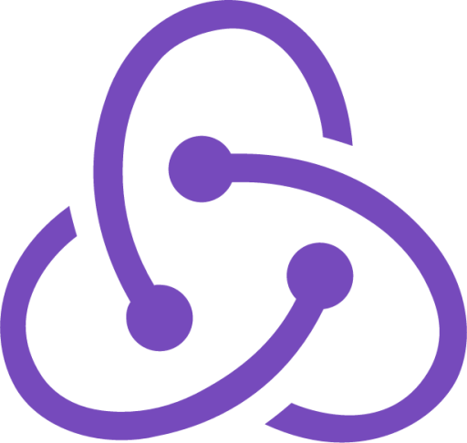
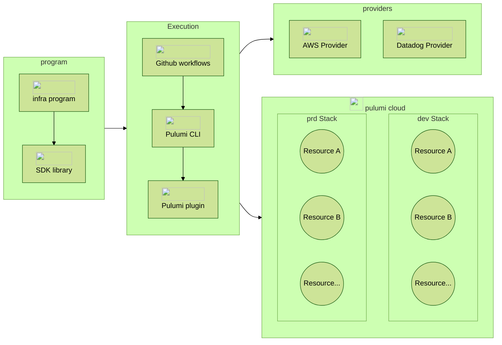
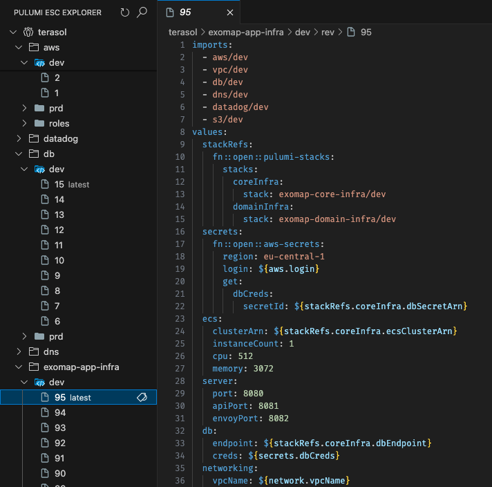

```mermaid
%%{init: {'theme':'forest'}}%%
sequenceDiagram
  MapLibre 🗺️ ->> ALB 🔀: GET tile/z/y/x (HTTP2)
  activate ALB 🔀
  Note right of ALB 🔀: HTTPS termination ❌
  ALB 🔀 ->> Envoy sidecar ↔️: HTTP1
  activate Envoy sidecar ↔️
  Envoy sidecar ↔️ ->> Http4s 🌐: HTTP/1.1 Upgrade to HTTP2
  activate Http4s 🌐
  Http4s 🌐 ->> Postgis 🛢️: SELECT ST_AsMVT (HTTP1)
  activate Postgis 🛢️ 
  MapLibre 🗺️ -x ALB 🔀: RST_STREAM
  ALB 🔀 -x Envoy sidecar ↔️: TCP FIN
  deactivate ALB 🔀
  Envoy sidecar ↔️ -x Http4s 🌐: RST_STREAM
  Http4s 🌐 -x Postgis 🛢️: JDBC `CancelRequest`
  deactivate Postgis 🛢️
  deactivate Http4s 🌐
  deactivate Envoy sidecar ↔️ 

```

slide-transition: true
build-lists: true
theme: Terasol
footer: Full-stack Scala
slidenumbers: true
autoscale: true

[.hide-footer]


^ Wait, full-stack Scala? do you mean full-stack, as in including the front-end?

---
## What? _**front-end**_ in Scala? 😮 

---
## What? _**front-end**_ in Scala? 

### Yep, _**front-end**_ and even _**ops**_ in Scala 🚀

^ as it turns out, you can do everything in Scala, all the way to ops

---
## Cool, but what **for**? 🤔

^ - when I say this, I usually get "ok that's cool, but who does that?"
- this is a tough one, you know, people are afraid of non-mainstream tech
- part of the reason i'm here talking, to show 
- 1. that it's really possible and
- 2. there are even advantages to do everything in Scala, because...

---
## Who _**wouldn't**_ want... 🤩

 - 🧑‍🤝‍🧑 _Type-based_ team alignment
 - 🦺 Higher bus factor 
 - 🔹 Smaller & leaner codebase
 - 👣 Reduced overall dependency surface
 - 💄 Cutting-edge UX
 - 🚀 WASM performance with flawless interop
 
^  - the entire team is able to intervene on all the parts, front-end, back-end, infra. They exchange in an ubiquitous language based on the same rich types.
 - thanks to this, loss of a team member is less detrimental, others can step in more easily, compare that vs having a teraform specialist, a typescript specialist, etc.
 - the codebase as a whole is leaner. benefit from code sharing between front and back, and from Scala's expressiveness. No more huge quantities of teraform YAML, helm charts, API definitions, etc.
 - third-party library surface and ecosystem is also naturally reduced. Less update work, less possibilities for unwanted regression, etc.
 - scalajs library ecosystem, laminar in particular, is super powerful and allows for richly interactive experiences
 - some say webassembly is the future for many applications, scalajs is ideally suited for that, imagine doing AI in the browser for privacy etc.

<!-- ---
## But...I'm a __backend__ engineer, period!
 - 💪 Think about it, you can do it all by ourself!
 - 🤖 AI age calls for generalists 
 - 🌟 Don't worry, your Scala skills will shine everywhere
 - 🥲 Programming joy FTW

^ - Ask the audience a show of hands if they consider themselves backend engineers
- I felt it very empowering personnaly, i can now build complete systems on my own, with solid tools
- Models are very good for specialized tasks, so now it's more and more about assembling pieces together and driving models
- Scala is powerful and mastering it means you will become immediatly very productive in these other domains
- Let's not forget this essential component, enjoying what we do is important and transpires on the systems we create    -->

---
## Past 10 months: my **full-stack** journey with Scala

- After 7 years of backend & microservices about 🚐 and 🚗
- Let's plant some 🌳! 

^ - BULLETS  
 - I've spent 7 years building microservices for the Bestmile fleet orchestration platform here in Lausanne
 - I'm very eco-sensitive, and I was approached to build a geospatial decision support system for urban renaturation, so I decided ok let's give it a go  

---


^ - Still a beta, the system shows various specialized maps, allows selecting parcels, taking measurements etc.
- My purpose here is to walk you through this codebase and share a bit of what I learned

---
## `build.sbt` structure
[.column] 


^ - Ok, finally getting more technical
- Starting with the project structure, I'm using trusty sbt 
- As you can see, there is a shared project between front and back

---
## `shared` project namespaces
- 📁 `endpoints`: endpoint definitions (using `tapir`)
- 📁 `model`: data classes 
- 📁 `i18n`: translation data classes  

^ - In this shared project, we mainly find
- endpoint definitions using tapir algebra, that's how we define our API, this is great to align client and server, more about this on the next slide
- model contains all the data classes of the API, together with serialization aspects
- internationalization i mention this here specifically because i'll use this common use case as guiding example thread throughout this presentation. Because it's so hard to pronounce i kind of regret it now aha 

---
## `tapir` endpoint definitions 
[.code-highlight: 1-2]
[.code-highlight: 3-4]
[.code-highlight: 5]
[.code-highlight: 6-7]
[.code-highlight: 8-9]
[.code-highlight: 10-11]
[.code-highlight: 12-14]
[.code-highlight: 1-14]

^ - So this is how you define endpoints with tapir
- of course starting with imports, including a module for micropickle, which we'll use for JSON serialization
- we also use iron for refined types, as we'll see shorty 
- we use a trait for our definitions, this keeps aspects separate and allows for mixins
- This is the endpoint that allows for retrieving translations. We express it with tapir DSL, with a path parameter of type Language, we'll see in a second how this is defined. I take this example because it's simple, and kind of universal to apps.
- we specify the types of response, micropickle codec is picked up by tapir
- finally we can even specify endpoint documentation

```scala
import sttp.tapir.*
import sttp.tapir.json.upickle.*
import com.terasol.exomap.shared.i18n.Translations
import com.terasol.exomap.shared.model.Language
import sttp.tapir.codec.iron.given

trait I18nEndpoints extends CacheHeaders:
  val i18n = endpoint.get
    .in("i18n" / path[Language]("lang"))
    .out(jsonBody[Translations])
    .out(oneHourCache)
    .description("Get translations for a certain language")
    .name("i18n")

```
---
## Iron types 
```scala
import io.github.iltotore.iron.*
import io.github.iltotore.iron.constraint.string.*

type Language = Language.T
object Language extends RefinedType[String, Match["^(en|fr|de|es|it)$"]]
```
- 💅 Compile-time & runtime type "refinements"
- ✅ Capture domain value constraints
- ⏬ Thanks to modules ecosystem, all the way into the DB 🛢️ !  

^ - I mentionned refined types
- In the system, the `Language` is such a refined type, we want a two char language code, and we only support certain languages. 
 - We use the iron library to define a refined newtype. This is a regex to match only certain language codes, at the type level. 
- so literals will fail at compile time, but also since we're using the iron module for tapir, API will automatically reject requests that do not comply, which is very convenient
- more typical use case might be email address, or strictly positive numbers, etc. all kinds of constraints are possible 
- there is support for doobie as well, so these contraints can be enforced at the type level all the way into the DB 

---
## Codec derivation
```scala
import upickle.default.*

case class Translations(popup: PopupLabels, map: MapLabels, settings: SettingsLabels) derives ReadWriter
case class PopupLabels(computing: String, parcel: String) derives ReadWriter
// ...
```

 - ⚙️ autogeneration of `ReadWriter` JSON codec
 - 1️⃣ plain case classes, single definition
 - 🔗 relaxed versioning

^ - here are the data classes involved in this endpoint
 - BULLETS
 - use the typeclass derivation syntax of Scala 3 for codecs
 - since it's in a shared project between front and back, single definition
 - also thanks to our particular setup where frontend and backend are coupled, we can be more relaxed about versioning. 
 - It's the same codebase, same team, you deploy updates at the same time. You can trigger client reload upon deploy for high availability app. 
 - if you do need to version, one technique is to name these data classes with version numbers  
 - So now that we have defined our endpoints and types, we can move on to creating the client project, the front-end

---

## `client` project
[.code-highlight: 1-3]
[.code-highlight: 4]
[.code-highlight: 5]
[.code-highlight: 6-7]
[.code-highlight: 8-11]
[.code-highlight: 12-21]
```scala
lazy val client = project
  .in(file("client"))
  .dependsOn(shared.js)
  .enablePlugins(ScalaJSPlugin)
  .enablePlugins(ScalablyTypedConverterExternalNpmPlugin)
  .settings(
    scalaJSUseMainModuleInitializer := true,
    scalaJSLinkerConfig ~= {
      _.withModuleKind(ModuleKind.ESModule)
        .withModuleSplitStyle(ModuleSplitStyle.SmallModulesFor(List("exomap")))
    },
    externalNpm := baseDirectory.value,
    libraryDependencies ++= Client.dependencies.value,
  )
 
```
^ - Let's now look at the client project, this depends on the scalajs side of shared cross-project
- we enable the scalajs plugin, of course
- and also scalablytyped, this will allow us to import typescript types definitions, we speak about that more later  
- Tell Scala.js that this is an application with a main method
- Emit ECMAScript modules, in such a way that they are small for our application, to optimize incremental reload
- and yes, Scalajs can use npm as a package manager! in fact,

---
## Just a **standard** Vite project 

📄 `vite.config.js`

```js
import scalaJSPlugin from "@scala-js/vite-plugin-scalajs";
```

^ - it's just a vite project! 
 - and scalajs has a vite plugin that makes vite aware of scalajs build and allows for hot reload

---
## Just a **standard** Vite project: `package.json`

```js
{
  "name": "exomap",
  "private": true,
  "type": "module",
  "scripts": {
    "dev": "vite",
    "build": "vite build",
    "preview": "vite preview",
    "clean": "rm -rf dist"
  },
  "devDependencies": {
    "@scala-js/vite-plugin-scalajs": "^1.0.0",
    "autoprefixer": "^10.4.20",
    "tailwindcss": "^4.1.5",
    "typescript": "^5.8.2",
    "vite": "^6.2.0"
  },
  "dependencies": {
    "@tailwindcss/vite": "^4.1.5",
    "flowbite": "^3.1.2",
    "maplibre-gl": "^5.2.0"
  }
}
```

^ as you can see, not looking at the details of this, but we even end up with a package.json in our scala project, which is kind of funny 

---

## `client` project namespaces
- 📁 `behaviors`: reactive, laminar-powered logic
- 📁 `components`: generic UI components 
- 📁 `pages`: browsable pages
- 📁 `services`: abstractions over endpoints and other sources
- 📁 `state`: models capturing app state

^ - Similar to what we did for the shared project, let's see how the client is structured. Note that this is a structure that works for me, it's by no means required or standard or anything like that
- in behaviors, i put all the code that describes things that happen in reaction to user events, scheduled events, async responses etc.  
- components is self-explanatory, self-contained UI code for things like popup, map, modal dialog, etc.
- pages, in there i have pages for each virtual route, this makes use of laminar routing ability. this is where the overal UI is assembled
- services, abstractions to endpoints or third-party APIs. Abstractions make it possible to test dependent pieces of logic
- state, this is where client-specific models and application state is captured 

---
## Web app entry point 🚪
```scala
  @main
  def Exomap(): Unit =
    renderOnDomContentLoaded(
      dom.document.getElementById("app"),
      rootElement()
    )

  def rootElement() = div(...)
  ```  
 - Just a standard Scala app with a `main`
 - Inject Laminar-managed root node in `<app>` element in `index.html`'s `<body>`

^- But, what is actually a scalajs app, you might ask? 
 - BULLETS
 - well, it's just a standard scala app with a main method
 - make use of laminar's renderOnDomContentLoaded() which hooks laminar root element to an app DOM element in index.html

---
## Let's create a button with **Laminar**! 


^ - So yes, I'm using Laminar to build the app
 - Laminar is this really awesome UI library for scalajs
 - Somewhat hidden gem honestly. Maybe the closest in JS world is solidjs. Also has similarities to Elm.
 - In my app I've got some settings panels as you can see
 - Let's see how to define some buttons using Laminar

---
## Laminar elements

```scala
import com.raquo.laminar.api.L.*

def applyChangesButton = button("Apply changes")
```

^ - With laminar, you first import the api
- this gives you access to a kind of DSL to create DOM elements
- so let's create our button
- the next question is how do you style this button, in my case i've used tailwind

---
## Tailwind CSS  styling
[.code-highlight: 4-10]

```scala
import com.raquo.laminar.api.L.*

def applyChangesButton = button("Apply changes", 
  cls := """bg-white hover:bg-gray-200 
  border-1 border-gray-300 
  disabled:text-gray-400 
  px-4 py-2 
  rounded""")
```

^ - Tailwind is a growing trend in the web 
 - basically use pre-defined classes to define the look of elements
 - it's called utility-first design: composable classes, directly in HTML instead of custom CSS

---


^ - vite tailwind plugin watches the files and generates the CSS corresponding to the classes
 - you can see how this works here, with the page updated as we edit it
 - you might have spotted some intellisense support, this is via a vscode plugin

<!-- 
---
## Tailwind CSS  IntelliSense


^  Plugin, can be customized to pick on scala files -->

---
## Flowbite components 


^ - Actually as it turns out you can find entire component libraries built with tailwind 
 - Ideally suited for buiding apps with laminar because it's straight DOM! 
 - These are real alternatives to react components
 - It doesn't mean you can't use react with laminar, you can
 - You can also use webcomponents such as https://webawesome.com/ 

---
## Let me **press** this button! 🫵
[.code-highlight: 9]

```scala
import com.raquo.laminar.api.L.*

def applyChangesButton = button("Apply changes", 
  cls := """bg-white hover:bg-gray-200 
  border-1 border-gray-300 
  disabled:text-gray-400 
  px-4 py-2 
  rounded""",
  onClick --> (event => dom.console.log(s"Button clicked: ${event.button}")))
```

^ - i know i know, you were dying to press the button 
- this lets me introduce an important syntax element from laminar's dsl, the arrow
- this is here a method that registers an event listener which will log the mouse button
- kind of underwhelming I know
- the problem with buttons is that they are often domain-specific
- so in order to continue speaking about laminar arrows, let's keep looking at an orthogonal concern universal to all UI applications, internationalization (and keep the prononciation challenge)

---
## Internationalization 🌐
[.code-highlight: 3, 11]

```scala
import com.raquo.laminar.api.L.*

def applyChangesButton(using locale: LocaleState) = 
  button(
    cls := """bg-white hover:bg-gray-200 
    border-1 border-gray-300 
    disabled:text-gray-400 
    px-4 py-2 
    rounded""",
    onClick --> (event => dom.console.log(s"Button clicked: ${event.button}")),
    text <-- locale.i18n$(_.settings.panel.applyChangesButton))
```

^ - so now you see the arrow pointing in another direction, towards the text of the button
 - This apply changes button needs to adapt dynamically to language setting 
 - <-- is actually laminar's subscription operator
 - we are here subscribing the text property of the button to language changes of this particular label
 - this internationalization$ expression is a laminar signal, coming out of locale state
 - let's see how LocaleState is defined

---
## Vars and signals 🔌
[.code-highlight: 1-6]
[.code-highlight: 7-9]
[.code-highlight: 1-10]

```scala
import com.raquo.airstream.state.Var
import com.raquo.airstream.core.Signal
import com.terasol.exomap.shared.i18n.Translations

trait LocaleState:
  val currentTranslations: Var[Translations]
  
  def i18n$(selector: Translations => String): Signal[String] = currentTranslations.signal.map(selector(_))
```

 - subscription: `text <-- locale.i18n$(_.settings.panel.applyChangesButton)`

^ - LocaleState is a trait, that has a currentTranslations laminar Var 
- This Laminar Var is not to be confused with scala's var
- the Var represents mutable state that can be observed
- it contains all labels for a certain language
- BULLET
- from this Var, we can derive a signal that allow us to subscribe to changes, as we have seen just before

---

# Laminar's parallel 🌳


^ - You might ask how does Laminar manage these subscriptions
 - The way it works is that by using Laminar's DSL we build a hierarchy of elements parallel to the dom. 
 - Laminar-managed elements have a common `RootNode` 
 - Laminar is tracking when elements must be mounted or umounted, and thus subscriptions activated or deactivated
 - Important mention here, it's not a virtual DOM with diffing, like you find in react

---

## Ownership and activation[^1]

```mermaid
%%{init: { "theme": "forest", "themeVariables": { "fontFamily": "monospace" } }}%%

sequenceDiagram
    participant ButtonElement as ButtonElement 🆗     
    participant Owner       as Owner 🚩
    participant Signal      as Signal 🔌
    participant Subscription as Observer 👁️
    participant DomApi      as DomApi 🕸️

    %% Mount + subscribe
    ButtonElement->>Owner: activate()
    Owner->>Signal: subscribe(callback)
    Signal-->>Subscription: onNext(newLabel)
    Subscription->>DomApi: setHtmlProperty(button, text, newLabel)

```



[^1]: Simplified view, for more check out [laminar docs](https://laminar.dev/documentation#laminars-use-of-airstream-ownership)

^  - let's look at this in more detail
 -	activate(): when the element is mounted in the DOM, it gets an Owner, which tracks its subscriptions. Activate is called on this Owner
  - let's say we have signal, like this internationalization signal
	-	subscribe(callback): we are subscribing to the signal, which gives us an Observer
	-	signal calls onNext on our observer every time the signal updates
	-	this callback is actually setHtmlProperty(…, text, newText): updates the button’s text

---

## Ownership and deactivation[^1]

```mermaid
%%{init: { "theme": "forest", "themeVariables": { "fontFamily": "monospace" } }}%%

sequenceDiagram
    participant ButtonElement as ButtonElement 🆗     
    participant Owner       as Owner 🚩
    participant Signal      as Signal 🔌
    participant Subscription as Observer 👁️

    %% Unmount + cleanup
    ButtonElement->>Owner: deactivate()
    Owner-->>Subscription: kill()
    Subscription-->>Signal: unsubscribe
```


[^1]: Simplified view, for more check out [laminar docs](https://laminar.dev/documentation#laminars-use-of-airstream-ownership)

^ - when the button is unmounted from the DOM 
 - it calls	deactivate() → kill() → unsubscribe: tears down the observer on unmount
 - let's now show a bit the kind of expressive power we gain with signals

---

## *Behaviors*: **functional reactive** logic 🛝

```scala
def i18nBehavior()(using locale: LocaleState, i18nService: I18nService): Modifier.Base =
  locale.currentLanguage.signal.flatMapSwitch(i18nService.translations) --> locale.currentTranslations
```

^ - Laminar allows for functional reactive coding style, also commonly known as the acronym FRP for functional reactive programming
 - Continuing our example here: we are reacting to language change by retrieving translations, which is another stream
 - I'm calling this a behavior, but that's just me
 - to do this, we use a high-order FRP operator, flatMapSwitch

---

## Essential FRP operator: **flatMapSwitch** 🛝

```mermaid
%%{init: { "theme": "forest", "themeVariables": { "fontFamily": "monospace" } }}%%

sequenceDiagram
    autonumber
    participant Switcher as languageSwitcher 🔘
    participant Lang    as currentLanguage 📚
    participant FlatMapSwitch as flatMapSwitch 🔀
    participant i18nService as i18nService ☁️
    participant Locale  as locale

    Switcher->>Lang: set "fr"
    Lang->>FlatMapSwitch: "fr" event
    FlatMapSwitch->>i18nService: switch to: translations("fr")
    i18nService->>Locale: set Translations(fr)
    i18nService->>Locale: update Translations(fr)

    Switcher->>Lang: set "en"
    Lang->>FlatMapSwitch: "en" event
    FlatMapSwitch->>i18nService: switch to: translations("en")
    i18nService->>Locale: set Translations(en)

```  



`currentLanguage$` __*flatMapSwitch*__ `i18nService.translations` `-->` `locale.currentTranslations`

^ - switch in flatMapSwitch means that the stream mirrors the inner stream
  - let's say there is a language menu, when there is an "fr" event, launch an inner stream which retrieves the french translations via the internationalization service. In the implementation that I have, this is an async call to the API, which is represented as a stream
  - when we get the translations, we set the locale
  - because this is also a stream, if we implement polling for instance, we might get updates from the backend
  - later on, if we switch to english, there is another event on the parent stream, we switch to the new inner stream, the english stream  
  - note that events propagate further through the observer graph: so when we set the current translations in locale, this is a Var, and it will trigger other events downstream, such as updating the button label as we coded before

---
## Behavior ⚙️ unit coverage ✅

```scala
 property("translations match the current language"):
    forAll: (additionalTranslations: Map[Language, Translations]) =>
      val translationsMap = additionalTranslations + (Language("en") -> Translations.default)
      given locale: LocaleState = mockedLocale
      given I18nService = new I18nService:
        def translations(language: Language) = EventStream.fromValue(translationsMap(language))

      withActivatedSubscriptions(i18nBehavior()):
        translationsMap.keys.foreach(locale.currentLanguage.set)
        assertEquals(
          locale.currentTranslations.now(),
          translationsMap(locale.currentLanguage.now())
        )
```        

^ - behavioral logic is what i generally like to have unit coverage for
 - in this case the logic is trivial but i'm just showing here how you can use your traditional testing tools from the scala ecosystem
 - munit property test making use scalacheck
 - not getting into the details but this property verifies that for all translations the current one matches the language

---
## Application state management 🗄️


^ - If you have ever coded UIs you will probably agree that managing state is a big deal
 - This diagram shows how I organized state and how with signals we can create a graph of behaviors reacting to events and state changes
 - 1. `State` contains all application state
 - 2. what i called behavioral logic listens to signals
 - 3. it might set elements of state, which in reaction might trigger other signals, etc.
 - 4. Then you have what I call UI components: these components are relatively generic and also have elements of state that are local to the component
  - 5. behaviors describe how global state is wired to local state via signals when mounted
  - 6. and vice/versa, describes how events influence evolution of global state
 - In summary, what i call behaviors act a bit as a switchboard   
 - Application state you potentially save in local storage or on the server, local state is ephemeral
 - That's the way I organized things, but you could do this differently

---
## **Redux** in Laminar 
[.code-highlight: 1-8]
<!-- [.code-highlight: 9-10]
[.code-highlight: 11-16] -->
[.code-highlight: 1-21]

```scala
import com.raquo.laminar.api.L.*

class ReduxBehavior[Action, State, Effect](
    actionsBus: EventBus[Action],
    maybeState: Var[Option[State]],
    reducer: (Action, Option[State]) => (Option[State], List[Effect]),
    effector: EventStream[Effect] => EventStream[Action]
):
  def modifier: Modifier.Base =
    val reducedActionsStream = actionsBus.toObservable.withCurrentValueOf(maybeState).map(reducer.tupled)
    val reducedStateStream = reducedActionsStream.map:
      case (newState, _) => newState
    val reducedEffectsStream = reducedActionsStream
      .map:
        case (_, effects) => effects
      .flatMapMerge(EventStream.fromSeq(_))
    modSeq(
      reducedStateStream --> maybeState,
      effector(reducedEffectsStream) --> actionsBus.writer
    )
```

^ - As a matter of fact, with Laminar you have full flexibility on how to organize your code
 - Can replicate redux pattern for more complex processes in your app, you know, piecewise
 - This piece of code is a fully functional Redux implementation
 - Not delving into the details here but it's just to illustrate how flexible this is
 - SHOW ALL CODE
 - I personally find Redux useful to define behavior with a strict state machine, when interactions become complex
 - I'm actually using this for an editor component in the app that has a lot of state and possible interactions

---
## Integration with **JS** libraries 

- A number of wrappers exist for mainstream libs or you can roll your own
- `ScalablyTyped` can convert TypeScript bindings to scala.js 🪄

^ - Another big topic is how to piggback on the massive JS library ecosystem
 - wrappers or write your own, but that's kind of tedious
 - what i am using and is absolutely fantastic is scalablytyped
 - sbt plugin that can generate scala wrappers from typescript definitions

---
## Integration with **maplibre** 

```scala
class MapLibreAdapter(using Locale, ...):
  val embedder: Modifier[ReactiveHtmlElement[HTMLElement]] =
    onMountUnmountCallbackWithState(
      mount = context => maplibre.Map(MapOptions(context.thisNode.ref)),
      unmount = (_, maybeMap) => maybeMap.foreach(_.remove())
    )
```

^ - In fact, as you've seen from the videos, it's a map-centric app, i'm using maplibre
 - maplibre is a big JS component, a fork of mapbox, that supports WebGL rendering
 - maplibre expects to be hooked to a DOM element
 - we can hook it into a laminar-managed element using this method that allows defining `mount` and `unmount` callbacks

---
## Integration with **maplibre**

```scala
class MapLibreAdapter(using Locale, ...):
  val embedder: Modifier[ReactiveHtmlElement[HTMLElement]] =
    onMountUnmountCallbackWithState(
      mount = context => maplibre.Map(MapOptions(context.thisNode.ref)),
      unmount = (_, maybeMap) => maybeMap.foreach(_.remove())
    )
```

🪝 hook it in the laminar tree:

```scala
div(
  cls := "h-screen w-screen antialiased absolute inset-0",
  mapLibre.embedder
)
```    

^ - as you can see here, at the usage site, hooking it into a div

<!-- ---
## Efficient lists

With laminar we create a single element per identifier
Using split, we describe this setup
And we perform updates on this existing element, we don't recreate it every time
Those precise update semantics avoid need for VDOM thanks to FRP -->

---
## **Service** abstraction  

```scala
trait I18nService:
  def translations(language: Language): EventStream[Translations]
```

^ - I showed earlier how we retrieve translations when there is a language change
 - as we briefly saw, this abstraction allows for unit testing

---
## *Sstp* **fetch-based** implementation  
[.code-highlight: 1]
[.code-highlight: 2-11]

```scala
class ApiClientBasedI18Service extends I18nService with I18nEndpoints:
  def translations(language: Language): EventStream[Translations] =
    EventStream.fromFuture(
      SttpClientInterpreter()
        .toClientThrowErrors(
          i18n,
          Some(uri"/api"),
          FetchBackend(fetchOptions = FetchOptions(credentials = None, mode = Some(dom.RequestMode.cors)))
        )
        .apply(language)
    )
```

^
- now in terms of its actual implementation, you'll also remember we defined endpoints with tapir
- so our implementation mixes in the endpoint definition so that 
- we can "interpret" it using sttp http client, using a fetch backend
- we could also implement polling with a scheduler, to allow for translation updates pushed from the backend, it's a stream here

--- 
## Backend: typelevel stack 🐱 


 - proven, performant
 - `IO`: a control-freak's dream 🤓
 - `Http4s` with `http4-netty` backend for HTTP2 support
 - `fs2`-driven tile server combined with `doobie` DB streaming

^ - Ok, so this gets us closer to the backend
 - we fuel the backend with the typelevel stack
 - it's been around for a while now and is in production in many places
 - cats-effect and the IO monad gives you full control, at the cost of a certain complexity for sure
 - for the web server, it's http4s and since i needed reliable HTTP2 support I'm using the netty backend
 - `fs2` is the streaming library in typelevel, running on IO, and i'm using this for my tile server as i'll describe shortly

---
## **http4s** server using **tapir** interpreter 🌐
[.code-highlight: 1]
[.code-highlight: 2]
[.code-highlight: 3-7]
[.code-highlight: 8]
[.code-highlight: 9-10]
[.code-highlight: 11]
[.code-highlight: 12-13]
[.code-highlight: 14]
[.code-highlight: 15]
[.code-highlight: 16-20]
[.code-highlight: 1-25]

```scala
class I18nHttpApp extends IOApp.Simple with I18nEndpoints:
  def run: IO[Unit] =
    val appResource =
      for
        given I18nService <- BabelBasedI18nService().toResource
        _ <- server
      yield ()
    appResource.useForever

  private def server(using i18nService: I18nService): Resource[IO, Server] =
    val interpreter = Http4sServerInterpreter[IO]()
    val serverLogic = i18n.serverLogicSuccess: language =>
      i18nService.translationsForLanguage(language)
    val routes = interpreter.toRoutes(serverLogic)
    val equippedRoutes = middlewareStack(routes)
    NettyServerBuilder[IO]
      .bindHttp(8080, "0.0.0.0")
      .withHttpApp(equippedRoutes)
      .resource

  private def middlewareStack(routes: HttpRoutes[IO]): HttpApp[IO] = ???
```

^ - so how do we build a http4s server with tapir
 - here for the sake of simplicity we'll only implement the internationalization endpoint
 - it's a cats-effect IOApp, we mix in the endpoints definition
 - the entrypoint is the run method
 - we first define the app resource, it needs an internationalization service, for which I am using a small nice library called Babel, hence the name
 - then we say that we'll use this app resource forever, that is until program termination
 - here's how we define the server
 - we get an interpreter for tapir definitions
 - we use tapir dsl to define the endpoint server logic
 - we get the http4s routes for this endpoint
 - which we decorate with all kinds of middleware, more on that shortly
 - then we can wire our server using the netty implementation 

---
## Rich middleware 🧰

```scala
private def middlewareStack(routes: HttpRoutes[IO]): HttpApp[IO] =
  CORS.policy.withAllowOriginAll.withAllowMethodsAll
    .withAllowHeadersAll(
      ResponseTiming(
        Date.httpApp(
          GZip(
            Logger
              .httpRoutes(
                logHeaders = true,
                logBody = false,
                logAction = Some(Console[IO].print)
              )(KamonSupport(routes, "localhost", 8080))
              .orNotFound
          )
        )
      )
    )
```      

^ - All kinds of middleware is available and of course you can define your own
- Intercepts requests and responses
- CORS, Timing, Dating, GZIP, logging, kamon, etc.

---
## Tile server 🗺️


^ - ok with this video i'm going to give you a headache
 - remember i told you i needed a tile server
 - Basically to create an interactive map navigation experience, maplibre is constantly issuing GET tile request over HTTP2
 - If you typically zoom in and out in quick succession, it's also able to cancel them, which you see on the right

---
## **Deep** cancellation: from `RST_STREAM` to `Statement#cancel()` 



^ - this sequence diagram shows the interaction between maplibre all the way into the DB
 - 1. so the tile request gets to the application load balancer over https
 - 2. AWS load balancer has a built-in certificate, you don't need to manage it so it's very convenient to have termination here
 - 3. the title request is forwarded to a server instance via HTTP1
 - 4. on the instance, i have an envoy proxy sidecar to upgrade http1 back to http2
 - the reason i'm doing this is to allow for termination detection
 - 5. we use a specific postgis function to retrieve a tile in binary format
 - 6. this is all done in streaming fashion, and if we get a RST_STREAM on the HTTP2 connection, cancellation can propagate all the way into the database, culminating in a JDBC cancel request 

---
## `fs2` and `doobie` to **stream** from DB 🌊
[.code-highlight: 1]
[.code-highlight: 2-8]
[.code-highlight: 9]
[.code-highlight: 10-13]

```scala
def layerTileQuery(layer: LayerRef, zoom: Int, x: Int, y: Int): fs2.Stream[ConnectionIO, Array[Byte]] =
  val query = fr"""
    WITH ... AS (
      ...
    )
    SELECT ST_AsMVT(mvt_geom.*, ${layer.id})
    FROM mvt_geom
  """
  query.query[Array[Byte]].stream

  def layerTile(layer: LayerRef, zoom: Int, x: Int, y: Int)(using xa: Transactor[IO]): fs2.Stream[IO, Byte] =
    layerTileQuery(layer, zoom, x, y).transact(xa).flatMap(fs2.Stream.emits)

```  

^ - codwise we implement this with fs2 and doobie 
 - we are defining here a stream of chunks of bytes forming up the tile
 - we use doobie DSL to define what is called an SQL fragment, here abridged
 - we indicate we want to stream it
 - the layerTile function interprets it on IO using the transactor, this represents our DB connection
 - now we get a stream of bytes that we can feed into the HTTP response

---
## **Route** definition with `http4s` 🛣️ 
[.code-highlight: 1-2]
[.code-highlight: 3-12]

```scala
case GET -> Root / LocationSlugVar(slug) / "metrics" / MetricLayerIDVar(metricLayerID) / 
    LongVar(v) / IntVar(z) / IntVar(x) / IntVar(y) =>
  Ok(
    service.layerTile(LayerRef(slug, metricLayerID), z, x, y)
      .onFinalizeCase:
        case ExitCase.Canceled =>
          logger.info(s"Cancelled streaming tile for $metricLayerID v$v $z/$x/$y")
        case _ => () // other cases elided
      ,
    contentTypeHeader,
    cacheControlHeader
  )
```

^ - this is precisely how we wire this tiling endpoint
 - we use http4s DSL for defining the route
 - then we wire the function we saw earlier, notice how http4s directly accepts an fs2 stream as a response
 - therefore, cancellation resulting from connection termination will thread its way through the stream chain


<!-- ---
## Internationalization
```scala
case class I18n(popup: PopupLabels, map: MapLabels, settings: SettingsLabels) derives ReadWriter, Schema
```

```scala

```    

```hocon
locationNotFound = {
  header = "We don't know %s yet"
  message = "...but nature should."
}
```

```scala
def apply(): IO[I18nService] =
    for
      babels <- Loader.default[IO].load("i18n", Set(Locales.en, Locales.fr))
      maybeTranslations <- IO
        .fromEither(Decoder[I18n].decodeAll(babels))
        .map(_.withFallback(Locales.en))
      translations <- IO.fromOption(maybeTranslations)(new IllegalStateException("Translations for en missing"))
    yield new BabelBasedI18nService(translations)

  private given Decoder[I18n] = deriveDecoder[I18n]
```  -->

---
## Container packaging: `sbt-jib` FTW 📦
[.code-highlight: 1-20]
[.code-highlight: 4-9]

```scala
.settings(
    jibBaseImage := "eclipse-temurin:21",
    jibName := "exomap",
    jibExtraMappings := {
      val base = baseDirectory.value
      val viteDistDir = base / ".." / "client" / "dist"
      val files = (viteDistDir ** "*").get
      files pair Path.rebase(viteDistDir, "/public")
    },
    jibVersion := sys.env.getOrElse("APP_VERSION", s"v${version.value}"),
    jibUser := Some("65534:65534"), // Set the user and group ID for the container (noboby:nogroup, minimal privileges)
    jibRegistry := ecrSplit.headOption.getOrElse("localhost"),
    jibCustomRepositoryPath := (if (ecrSplit.drop(1).nonEmpty) Some(ecrSplit.drop(1).mkString("/")) else None),
    jibPlatforms := Set(JibPlatforms.amd64),
    jibJvmFlags += "-XX:+EnableDynamicAgentLoading",
    javaOptions += "-XX:+EnableDynamicAgentLoading" // Enable dynamic agent loading for Kamon
  )
```  

^ - So how do we package our server now? for this I'm using another sbt plugin, sbt-jib. You can define all kind of properties, base image, etc. 
- One thing worth mentionning here is how I package the client, you can see that I pick the output of the vite build and put it into public, quite simply
- For static files, I actually use http4s itself, not a separate server
- But ok, clearly building the container isn't the end of the story, we need to deploy that stuff
- Oh darn, will I have to touch some YAML?  
- Show of hands: who, like me, suffer from YAML alergy? instant red eyes for detecting spaces, headaches, etc.
 - I have some good news!  

---
## **Scala**4**Ops**: besom & pulumi 🏭
[.code-highlight: 1-20]
[.code-highlight: 1-3]
[.code-highlight: 4]
[.code-highlight: 5-10]
[.code-highlight: 11]
[.code-highlight: 12]
[.code-highlight: 1-20]

```scala
import besom.*
import ...

@main def main: Unit = Pulumi.run:
  given Input[EcsConfig] = config.require("ecsConfig")
  given Input[Networking] = config.require("networking")
  given Input[DatadogConfig] = config.require("datadogConfig")
  given Input[DatabaseConfig] = DatabaseConfig(config.require[RawDatabaseConfig]("dbConfig"))
  given Input[ContainerImage] =
    config.require[NonEmptyString]("ecrUrl").zip(config.require[NonEmptyString]("appVersion")).map(ContainerImage.apply)
  val service: Output[Service] = Service("exomap")
  Stack(service).exports(fargateUrn = service.fargate.urn)
```
 > "I suddenly felt an infra superman" 🦸
-- long-time coder and YAML alergic 

^ - Witness here a standard Scala program
 - This is a program that will deploy our server
 - The most relevant import is besom of course, the fantastic pulumi driver from virtus lab
 - The first line shows that we are defining a pulumi program
 - Config is a big thing in infra, we start by initializing a number of config givens with various values. Enumerate
 - This constructor creates a Service component, this is a custom kind of generic service component that I defined in a separate file, where the necessary infra for AWS fargate is done etc. It's using all these givens. We get a component wrapped in an `Output` monad, that's besom's main abstraction for things that need to exist in the infra space at the end of the program.
 - At the end, `Pulumi.run` expects a `Stack` instance, with all the outputs we have provisioned. We can also export some particular values: these can be reused in other stacks.

---
## Ok, but **how** does it work?



^ - We have our program, written in Scala using the Besom SDK
 - We create a github workflow, which makes use of the Pulumi CLI
 - The pulumi CLI has a plugin that can interpret besom programs
 - Running the program makes use of providers to drive the actual provisioning
 - It also keeps a state in the Pulumi cloud, which is a paid service, or your own storage, like S3 

---
## Pulumi cloud **dashboard**


^ - If you pay for the pulumi cloud offering, you get a nice dashboard where you can see all your stacks, resources, etc.

---
## Pulumi PR **previews**


^ - What's cool is also the previewing ability, showing you what will change if you merge your PR

---
## Pulumi **ESC** 🔒 

- *Environments, Secrets, and Configuration*: secure repository for static and dynamic config values and secrets
- Can import values from pulumi stacks, supports plugins (e.g. AWS Secret Manager)
- YAML structure, VS code integration

^ - As we all know, a big operational challenge is how to manage secrets and configuration values 
 - Pulumi has a worthy complement for that, it's called ESC
 - Stands for ...
 - It can import values...
 - Yeah sorry we're back to some YAML after all, but really minimal, no template programming 

---
## Pulumi **ESC** 🔒
[.column]



 integration

[.column]

```yaml
pulumiConfig:
  aws:region: ${aws.region}
  ecsConfig: ${ecs}
  ecrUrl: ${stackRefs.domainInfra.ecrUrlForPatcher}
  dbConfig: ${db}
  datadogConfig: ${datadog}
  networking: ${networking}
```    

key/value YAML
(but no templates) 😉

^ - see here, all the values under pulumi config will populate our config that we were loading before, here referencing structures defined in other dedicated places in the configuration

---
## `/infra/.../build.sbt` structure


^ - To develop your pulumi program, you can use the Scala CLI
 - Or sbt, which is what I'm doing, with multiple projects sharing some assets such as types 
 - Yes I'm using refined types for besom programs too, for configuration safety :)
 - In domain, DNS, in the core, DB mainly, app the server and ECS
 - Because these are standard Scala programs, you can publish libraries, possibilities are endless 

---
## Take-away 🍔
 - 🦸 You *really* can do everything with Scala
 - ♦️ Compact, efficient, safe, uniform codebase from front to back plus ops
 - 🧑‍🤝‍🧑 Great for product teams or solo players
 - 🌟 Your Scala skills can shine everywhere
 - 🥲 Programming joy FTW
 
^ - I hope i was able to give you a taste of what full-stack scala feels like
  - Yes, you really can do it all in Scala
  - Leads to compact...
  - Great for product teams, it promotes alignment, or solo players, you master one stack
  - As a motivation, you know AI age calls for generalists
  - Last but not least, it's also about enjoying what we do  

---


^ - so on this, i would like to give special thanks library authors and contributors that make this joy of coding possible day-to-day, and to the scala community at large
- thank you all for your attention, comments and questions 